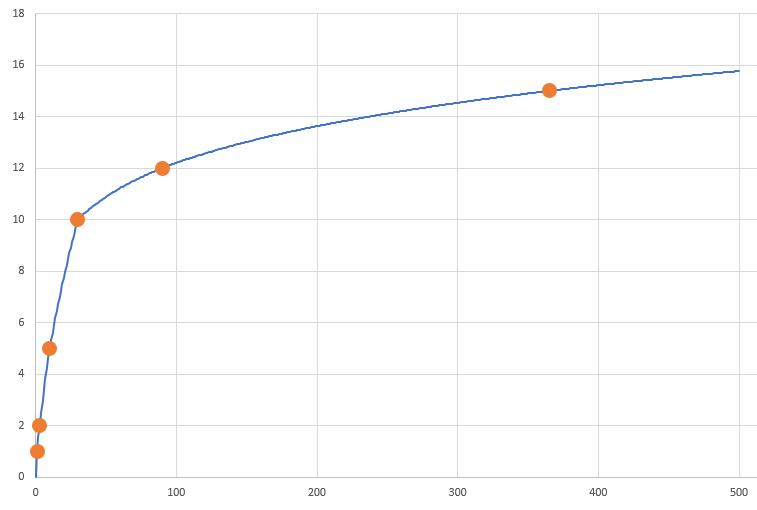

# Backup pruner

*Backup pruner* is a tool helping with regular cleanup of old backups.

It periodically scans a given directory (filesystem, S3 and SFTP are currently
supported) containing the backups, removing files which are likely the least
valuable ones, preventing the directory from unlimited growth.

The number of backups to keep in a given time period can be configured:
you can for example define that you wish to keep 1 backup for the last day,
2 backups for the last 3 days, 5 backups for the last 10 days, 10 backups
for the last month, 12 backups for the last 3 months and 15 backups for
the last year. Backup pruner does not care whether the backups are created
regularly or whether there are gaps and/or extra backup files. Nor does
it care whether there are at least as many files as specified (in this case
it will simply not delete anything in the given time period). It will do
its best to keep the desired numbers of files for the given time period.

You don't need to specify the desired counts in detail. It's fine to define
that for example for the last day there should be 1 backup and for the last
year there should be 15 backups kept. Backup pruner will derive the optimal count
for any time interval from that. It is, however, recommended to define a
handful of points close to zero (e.g. a day ago, two days ago, five days ago),
because even though the derived optimal counts can be a mathematically elegant
function, it may behave counter-intuitively close to zero.

## Using Backup pruner

Backup pruner is distributed as a Docker image. The description below assumes
you know how to run Docker containers.

This is an example configuration

```
docker run \
    --privileged \
    --name backup-pruner \
    --rm \
    --env OPTIMAL_COUNT_CONFIG='1d: 1, 3d: 2, 10d: 5, 30d: 10, 90d: 12, 365d: 15' \
    --env STORAGE_TYPE='S3' \
    --env S3_ACCESS_KEY='AAAABBBBCCCC1111DDDD' \
    --env S3_SECRET_KEY='aaAAbbBBccCCddDDeeEEffFFggGGhhHH11112222' \
    --env S3_BUCKET='my-backup-bucket' \
    --env SCAN_INTERVAL='30m' \
    --env SEND_EMAIL='true' \
    --env LONGEST_DELAY_BETWEEN_EMAILS='12h' \
    --env SMTP_HOSTNAME='mail.example.com' \
    --env SMTP_PORT='465' \
    --env SMTP_DOMAIN='example.com' \
    --env SMTP_USER='admin@example.com' \
    --env SMTP_PASSWORD='3ecre1' \
    --env SMTP_ENABLE_SSL='true' \
    --env EMAIL_FROM='admin@example.com' \
    --env EMAIL_TO='admin@example.com' \
    --env EMAIL_SUBJECT='Backup pruner results' \
    --env DO_PRUNE=true \
    any3w/backup-pruner
```

Here we define a container which will every 30 minutes
(variable `SCAN_INTERVAL`) scan a directory on an S3 bucket
(variable `STORAGE_TYPE`, variables `S3_*`). The desired counts
of backup files to keep are specified the same as in one of the
previous paragraphs (variable `OPTIMAL_COUNT_CONFIG`). The container
is configured to send emails informing about the backups
(variable `SEND_EMAIL`) using
the given SMTP server (variables `SMTP_*` and `EMAIL_*`).
An email will be sent if at least one file is deleted, but also if
the last email was sent a long time ago (variable
`LONGEST_DELAY_BETWEEN_EMAILS`), even if no file was deleted. **The last
variable (`DO_PRUNE`) must be present and set to "true" if any files
shall be deleted. Otherwise it will do just a dry-run (determine
which files to remove, send an email about it, but not actually
delete anything).**

The privileged mode is needed if the backup files are on S3
(needed to mount the diretory using s3fs).

This is an example of a similar configuration for a local filesystem
directory:

```
docker run \
    --name backup-pruner \
    --rm \
    --env STORAGE_TYPE='filesystem' \
    --env OPTIMAL_COUNT_CONFIG='1d: 1, 3d: 2, 10d: 5, 30d: 10, 90d: 12, 365d: 15' \
    --env DIRECTORY='/tmp/test' \
    --env SCAN_INTERVAL='30m' \
    --env SEND_EMAIL='true' \
    --env LONGEST_DELAY_BETWEEN_EMAILS='12h' \
    --env SMTP_HOSTNAME='mail.example.com' \
    --env SMTP_PORT='465' \
    --env SMTP_DOMAIN='example.com' \
    --env SMTP_USER='admin@example.com' \
    --env SMTP_PASSWORD='3ecre1' \
    --env SMTP_ENABLE_SSL='true' \
    --env EMAIL_FROM='admin@example.com' \
    --env EMAIL_TO='admin@example.com' \
    --env EMAIL_SUBJECT='Backup pruner results' \
    --env DO_PRUNE=true \
    -v c:/tmp/testfiles:/tmp/test \
    any3w/backup-pruner
```

## Details of optimal count config

The optimal count config (environment variable `OPTIMAL_COUNT_CONFIG`)
is a mandatory parameter specifying how many files should be ideally
kept for a given time period.

It consists of a list of points, each point consists of a *time ago*
specification and a *count* specification. The meaning of these two
specifications is: for the time period between now and *time ago*
there should be ideally *count* files kept.

The individual points are comma-separated (with optional white space
between). Each point consists of a *time ago* specification followed
by a colon, an optional white space and a *count* specification.

The *time ago* specification consists of a value and a unit. The
supported units are: `s` (second), `m` (minute), `h` (hour),
`d` (day), `w` (week), `M` (month), `y` (year). They are case-sensitive -
pay attention to the difference between month (`M`) and minute (`m`).
The units can be combined, e.g. `1h30m` for one hour and 30 minutes.

### Algorithm

Backup pruner parses the optimal count definition. It then plots the
points in the definition into a graph, x-axis being the *time ago*
(current time at the left) and y-axis being the *count*. It then
connects all the points with a smooth curve. The curve represents an
*optimal count function* (`optimalCount`).



Backup pruner always keeps the newest and the oldest backup in the specified
directory. It calculates the optimal number of intermediate files to keep
as <br/> `optimalCount(oldest) - optimalCount(newest)`.

It then goes through all the intermediate files and for each file it calculates
its value. A value of an n-th file (where n = 0 for the newest file, 1 for the
second newest, etc.) if calculated as <br/>
`optimalCount(n + 1) - optimalCount(n - 1)`. It then removes the file with the
lowest value and repeats the process until the desired number of intermediate
files is left.

## Notification emails

If the `SEND_EMAIL` variable is set to `true`, Backup pruner will send a notification
email
 * when at least one file was deleted (if `DO_PRUNE` is `false`, the email is sent if
 some files *would* be deleted if `DO_PRUNE` was `true`), and also
 * when no file was (would be) deleted, but the last notification email was sent long
 ago.
 
What it means "long ago" is defined by the `LONGEST_DELAY_BETWEEN_EMAILS` variable.
This variable value consists of a number and a unit. The
supported units are: `s` (second), `m` (minute), `h` (hour),
`d` (day), `w` (week), `M` (month), `y` (year). They are case-sensitive -
pay attention to the difference between month (`M`) and minute (`m`).
The units can be combined, e.g. `1h30m` for one hour and 30 minutes.

#### SMTP config

The following variables control SMTP:

 * `SMTP_HOSTNAME` - hostname, usually in the form `mail.example.com` or `smtp.example.com`
 * `SMTP_PORT` - port, usually 465 if SSL is enabled, 25 if not
 * `SMTP_DOMAIN` - domain, usually the same as hostname, but without the first bit, e.g. `example.com`
 * `SMTP_USER` - username, often identical with the sender's email address
 * `SMTP_PASSWORD` - password, not encrypted
 * `SMTP_ENABLE_SSL` - set to `true` to enable SSL

## S3-specific settings

 * `STORAGE_TYPE` - to scan files in an S3 bucket, set to `S3`
 * `S3_ACCESS_KEY` - S3 access key
 * `S3_SECRET_KEY` - S3 secret key
 * `S3_BUCKET` - S3 bucket ID
 * `S3_ENDPOINT` - URL of the S3 endpoint if using an alternative S3-compatible server, example: `http://minio.example.com:9000`; do *not* define if using S3 on AWS (which is very likely the case) 
 
## SFTP-specific settings

 * `STORAGE_TYPE` - to scan files on an SFTP server, set to `SFTP`
 * `SFTP_HOSTNAME` - server hostname
 * `SFTP_DIRECTORY` - directory (on the SFTP server) to scan
 * `SFTP_USER` - SFTP server user name
 * `SFTP_PASSWORD` - SFTP server user password (if using password authentication)
 * `SFTP_PRIVATE_KEY` - path to the private key (if using key authentication) on the Docker instance
   (this option will be typically used in conjunction with a directory mapping `-v`)
 * `SFTP_KEY_PASSPHRASE` - private key passphrase; used if `SFTP_PRIVATE_KEY` is used and the key is
    passphrase-protected (if the key is not passphrase-protected, simply do not mention this environment variable)
 
**example:**

```
docker run \
    --privileged \
    --name backup-pruner \
    --rm \
    --env OPTIMAL_COUNT_CONFIG='1d: 1, 7d: 5, 30d: 8, 90d: 12, 365d: 15' \
    --env STORAGE_TYPE='SFTP' \
    --env SFTP_HOSTNAME='server.example.com' \
    --env SFTP_DIRECTORY='/var/backups' \
    --env SFTP_USER='test' \
    --env SFTP_PRIVATE_KEY='/tmp/id_rsa' \
    --env SFTP_KEY_PASSPHRASE='s3cre1' \
    --env SCAN_INTERVAL='5m' \
    --env SEND_EMAIL='true' \
    --env LONGEST_DELAY_BETWEEN_EMAILS='10m' \
    --env SMTP_HOSTNAME='mail.example.com' \
    --env SMTP_PORT='465' \
    --env SMTP_DOMAIN='example.com' \
    --env SMTP_USER='admin@example.com' \
    --env SMTP_PASSWORD='s3cre1' \
    --env SMTP_ENABLE_SSL='true' \
    --env EMAIL_FROM='admin@example.com' \
    --env EMAIL_TO='test@example.com' \
    --env EMAIL_SUBJECT='Backup prune results' \
    --env DO_PRUNE=false \
    -v "/user/test/.ssh/id_rsa:/tmp/id_rsa" \
    any3w/backup-pruner
```
 
## Filesystem-specific settings

 * `STORAGE_TYPE` - to scan a directory on a filesystem, set to `filesystem`
 * `DIRECTORY` - full path to the directory to scan
 
## General settings

 * `DO_PRUNE` - if set to `true`, the files will actually be deleted,
   otherwise just a dry-run will be done (even for dry-run the notification
   email will be sent, listing files which would be deleted)
 * `SCAN_INTERVAL` - how often to scan the directory; This variable value consists of a number and a unit. The
   supported units are: `s` (second), `m` (minute), `h` (hour),
   `d` (day), `w` (week), `M` (month), `y` (year). They are case-sensitive -
   pay attention to the difference between month (`M`) and minute (`m`).
   The units can be combined, e.g. `1h30m` for one hour and 30 minutes.
   
## Docker Hub repository

https://hub.docker.com/r/any3w/backup-pruner/